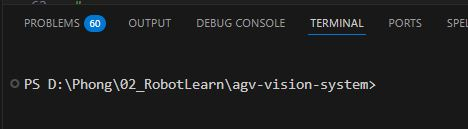

```markdown
# Virtual Environment — Separate Python Environment for Each Project

## What is `venv`?

A **Virtual Environment** is an isolated Python environment created for a specific project.

It allows each project to have its own dependencies and package versions without affecting others.

---

## Why Do We Need It?

Imagine your computer has two projects:
```

Project A → needs requests==2.0
Project B → needs requests==3.0

```

Without a virtual environment, both projects use the same global Python installation → ❌ **version conflict** (you cannot install two different versions at the same time).

With `venv`:

```

Project A → its own .venv → requests==2.0 ✅
Project B → its own .venv → requests==3.0 ✅

````

Each project has its own isolated “Python box” and they do not interfere with each other.

---

## How to Set Up

### 1️⃣ Create a virtual environment

```python
python -m venv .venv
````

This creates a folder named `.venv` inside your project.

---

### 2️⃣ Activate the environment (Windows)

```console
.venv\Scripts\activate
```

After activation, your terminal will show `(.venv)` at the beginning of the line.

---

### 3️⃣ Install dependencies

For example, if you want to run `camera_server.py` inside the `camera` folder:

```bash
pip install -r camera/requirements.txt
```

---

### 4️⃣ Run the Python app

```python
python camera/camera_server.py
```

---

# Running When `.venv` Already Exists but Is Not Activated

## 1️⃣ Check whether it is activated

If you just turned on your computer, the terminal might look like this (no `(.venv)` in front) → ❌ Not activated.

But the `.venv` folder from a previous setup is still there.

---

## 2️⃣ Activate it again

```console
.venv\Scripts\activate
```

---

## 3️⃣ Run the app

```python
python camera/camera_server.py
```

---

## ✅ Summary

- `venv` = isolated Python environment per project
- Prevents dependency conflicts
- Always activate `.venv` before running your project
- Each project should have its own `.venv` folder

```

```

===================================================================
Vietnamese
===================================================================

# Virtual Environment — môi trường Python riêng biệt cho từng project.

## venv là gì?

Virtual Environment — môi trường Python **riêng biệt** cho từng project.

## Tại sao cần?

Hình dung máy bạn có 2 project:

```
Project A  →  cần requests==2.0
Project B  →  cần requests==3.0
```

Nếu không có venv, cả 2 dùng chung Python global → **xung đột**, không thể cài 2 version cùng lúc.

Với venv:

```
Project A → .venv riêng → requests==2.0  ✅
Project B → .venv riêng → requests==3.0  ✅
```

Mỗi project có "hộp" Python riêng, không ảnh hưởng nhau.

## Cách cài

1. Tạo .venv

```python
python -m venv .venv
```

2. Activate

```console
.venv\Scripts\activate
```

3. Cài dependencies (ví dụ muốn chạy file camera_server.py đăng nằm trong folder camera)
   pip install -r camera/requirements.txt

4. Run python app

```python
 python camera/camera_server.py
```

## Chạy khi đã có sẵn môi trường .venv nhưng chưa được active

1. Check active hay chưa
   nếu mới bật máy sẽ hiện như dưới, là chưa acvtive
   

nhưng sẽ có .venv của lần trước cài rồi


2. Activate

```console
.venv\Scripts\activate
```

3. Run python app

```python
 python camera/camera_server.py
```
