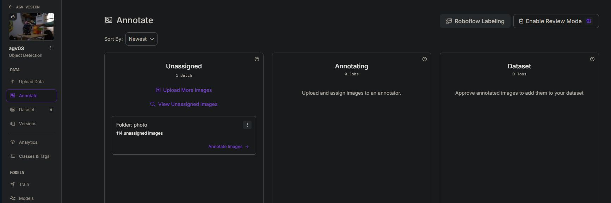
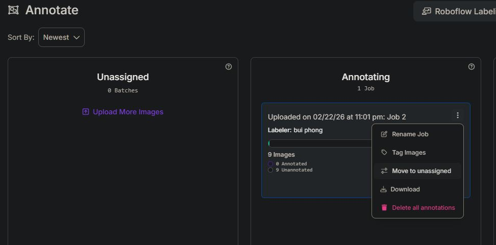
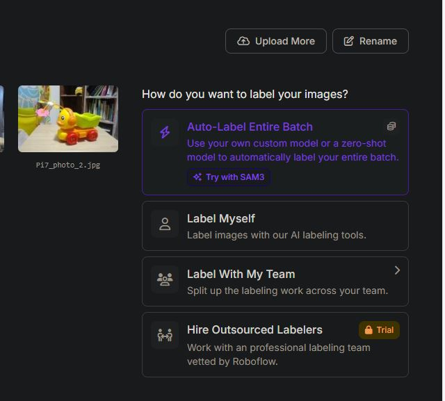
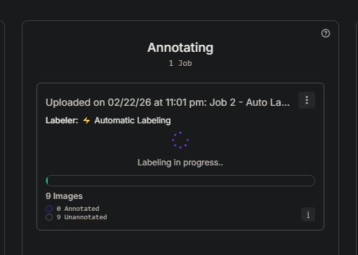
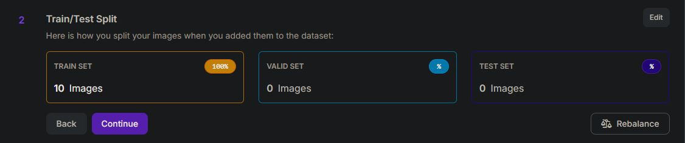
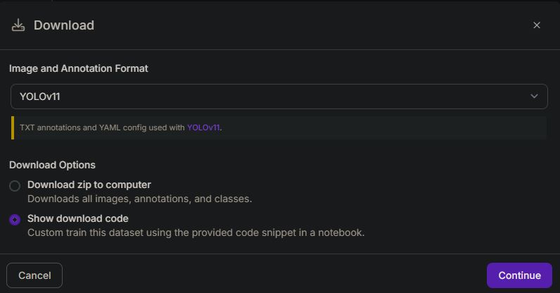
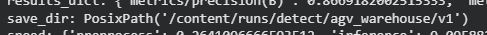
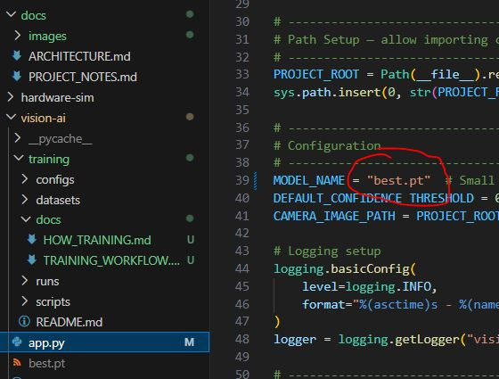
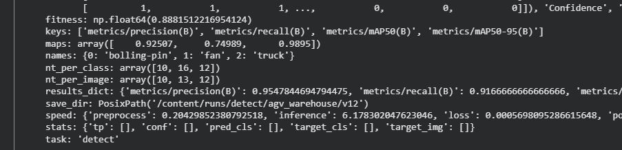

# How to Train an AI Model

## Define the Objects to Detect

Identify the objects you want the model to detect.  
For example:

- truck
- fan
- bolling-pin

---

## Take Photos

### Image Criteria

- Capture from multiple angles, based on the actual camera viewpoint.
- Shoot at different times of day, with different lighting conditions, and varying distances.
- Include occlusions (one object partially covering another).
- Include multiple objects in the same frame.
- Use complex, realistic backgrounds similar to the actual factory environment.

### Phone Camera Settings

- Aspect ratio: **16:9**
- Resolution: **1920×1080**

> YOLO is designed to process square images — typically 640×640 or 1280×1280.  
> When receiving non-square images, it applies _letterboxing_ (adds black padding) to make them square before inference.  
> During training, 16:9 images are automatically handled by Roboflow — but if possible, 4:3 (1280×960) or 1:1 aspect ratio works better for YOLO than 16:9.

---

## Assign Class Names to Each Object

Use **roboflow.com** to perform labeling.

### Upload Images and Create a Dataset

1. New Project → Object Detection
2. Upload images → Save and Continue
3. Images will appear in **Unassigned**  
   

4. Choose **Label Myself**
5. Select **Box Prompting**  
   

6. Name the class
7. Click the right arrow and continue drawing boxes for remaining objects
8. Repeat for around 10 images or more
9. Go back to the **Annotate** folder — you will see annotated and non-annotated images

    > In this example: 1 image annotated, 9 not  
    > 

10. Select the annotated image(s) and choose **Annotated**  
    

11. Click **Add image to Dataset**
12. In the Annotate folder, select the remaining images under **Annotating**  
    

13. Click the three dots (…) and move the 9 images back to **Unassigned**  
      
    After moving:  
    

14. Select those 9 images for **Auto Labeling**  
    

15. Choose the **Instant** model to automatically detect classes  
    (This Instant model was created in step 11 when adding images to the dataset.)  
    Verify whether all 3 desired classes are detected.  
    

16. Click **Auto Generate**
17. It will preview 4 images with predicted detections.  
    Click **Next** to verify predictions.  
    

18. If everything looks correct, click **Auto Label with this Model**
19. The system will automatically label the remaining 9 images  
    

20. After completion, manually review the annotations  
    

21. Open each image and click **Approve** if correct
22. Click **Add Approved to Dataset**  
    

23. Result: 10 images successfully added to the Dataset  
    

---

## Create a Version

Now that the Dataset is ready, generate a version compatible with your training model (YOLO in this case).

1. Select **Versions**
2. Name the version
3. Split images into:
    - Train (learning data)
    - Validation (checked during training)
    - Test (final evaluation)  
      Click **Rebalance** for automatic distribution  
      

4. Resize: Select **Fit black edges in 640×640**  
   

5. Add augmentations to increase dataset diversity:
    - Flip → Horizontal
    - Brightness -25 / +25
    - Blur 1px

6. Choose augmentation multiplier (×3, ×10, ×20)
7. Click **Create**
8. Download Dataset
9. Select **YOLOv11** format
10. Show download code → Continue  
    

11. Copy the Python code for Google Colab training  
    

---

## Training

Train using **colab.research.google.com**

1. Create a new notebook in Google Drive
2. Change runtime to **T4 GPU** → Click Connect  
   

3. Install dependencies:

```python
!pip install ultralytics roboflow
```

4. Restart runtime

5. Run the Roboflow code to load the dataset
   
   After execution:
   

6. Check if the `.yaml` file exists:

```python
!ls {dataset.location}
```

7. Start training:

```python
from ultralytics import YOLO

model = YOLO("yolo11s.pt")  # pretrained model, fine-tune further

model.train(
    data=f"{dataset.location}/data.yaml",
    epochs=50,
    imgsz=640,
    batch=16,
    patience=10,  # early stopping
    project="agv_warehouse",
    name="v1"
)
```

If there are no errors:


8. After training, `best.pt` will be saved here:
   

9. Download `best.pt`
   

---

## Run Inference

1. Copy `best.pt` into your `vision-ai` folder

2. In `app.py`, change the model from `yolo11s.pt` to `best.pt`
   

3. Run `app.py`

### Test via Swagger Web UI

Open:

```
http://localhost:8000/docs
```

Upload an image to test detection.

Success ✅

---

# Training Evaluation



## Main Metrics

| Metric       | Value     | Evaluation                                                                    |
| ------------ | --------- | ----------------------------------------------------------------------------- |
| Precision    | **0.955** | Excellent — when it says "this is an object," it is correct 95.5% of the time |
| Recall       | **0.917** | Very good — detects 91.7% of real objects                                     |
| mAP@0.5      | **0.936** | Very good — production threshold usually > 0.85                               |
| mAP@0.5-0.95 | **0.888** | Good — stricter metric, > 0.8 is strong                                       |
| Fitness      | **0.888** | Overall score, closer to 1 is better                                          |

---

## Per-Class Performance

| Class         | mAP       | Test Images | Comment                   |
| ------------- | --------- | ----------- | ------------------------- |
| `bolling-pin` | **0.925** | 10          | Good                      |
| `fan`         | **0.750** | 16          | Weakest — needs more data |
| `truck`       | **0.990** | 12          | Nearly perfect            |

---

## Important Notes

- **`fan` mAP = 0.75** — significantly lower than the other classes.
  Common causes:
    - Fan images are too dark or mostly black
    - Insufficient angle variation
    - Confusion with background

- **Inference speed: 6.2ms** — very fast, suitable for real-time GPU deployment.

================================================================
Vietnamese
================================================================

# How to train AI model

Xác định những object muốn detect
ví dụ:
truck
fan
bolling-pin

## Chụp ảnh

### Tiêu chí ảnh

Chụp nhiều góc độ, theo góc nhìn của camera
Các khung giờ khác nhau, độ sáng khác nhau, xa gần khác.
Vật này che vật khác, có nhiều vật trong 1 khung hình
Bối cảnh sau vật hỗn loạn phức tạp, giống với thực tế trong xưởng.

### Setting camera điện thoại

Tỉ lệ khung hình 16x9 1920x1080

> YOLO được thiết kế xử lý ảnh vuông — 640x640, 1280x1280. Khi nhận ảnh không vuông, nó letterbox (thêm dải đen) để thành vuông trước khi inference. Với training data, ảnh 16:9 sẽ được Roboflow xử lý tự động — nhưng nếu bạn có thể chọn thì 4:3 (1280x960) hoặc 1:1 tốt hơn 16:9 cho YOLO.

## Gán tên class cho từng object

Dùng roboflow.com để thực hiện labeling

### Up ảnh và tạo Dataset

1. New project > Object Detection
2. Upload image > save and continue
3. Lúc này image se nằm ở Unassigned
   

4. Chọn Label Myself
5. Chọn Box Prompting
   

6. Đăt tên cho class
7. Nhấn mũi tên qua phải rồi Vẽ tiếp cho các vật còn lại
8. Làm y chang vậy cho khoảng 10 tấm hơn gì đó.
9. Trở lại thư mục Annotate, sẽ thấy những tấm đã được annotate
    > trong ảnh là 1 tấm đã được annotate, 9 tấm chưa
    > 
10. Click vào đống ảnh đó và chọn vào mục Annotated
    
11. Chọn Add...image to Dataset
12. Trong thư mục Annotate lại chọn vào đống ảnh còn lại trong Annotating
    
13. Chọn ... để di chuyển 9 tấm ảnh dó vào lại cột Unassigned
    
    đã move
    
14. Chọn vào 9 tấm đó để Auto Labeling
    
15. Chọn instant để giúp tự động phát hiện class, instant này được tạo ra từ bước 11 khi add image to dataset (maybe :) )
    Chọn xong thì check xem đã đủ 3 class theo mong muốn chưa
    
16. Nhấn Auto General
17. Nó sẽ hiện ra 4 tấm mà dựa theo cái instant đã chọn , nó phán đoán các vật trong ảnh.
    Cứ click next để xem nó chọn có đúng không.
    
18. Nếu thấy ok rồi thì click vào Auto Label with this Model
19. Nó sẽ chạy tự động để vẽ vật cho mình hết 9 tấm còn lại.
    
20. Sau khi chạy xong, nhiệm vụ của mình là check lại xem nó vẽ đúng không
    
21. Click vào từng tấm ảnh và nhấn Approve nếu đồng ý những gì nó vẽ.
22. Add Approved to Dataset
    
23. Kết quả thành công 10 ảnh trong Dataset
    

## Version

Giờ đã có Dataset, tiếp tục lấy ra thư viện phù hợp với model để training, (ở đây là yolo)

1. Chọn Versions
2. Đặt tên version
3. Chọn phân bổ image cho Train/Valid/Test
   Train (ảnh để học)
   Validation (ảnh để kiểm tra trong lúc học)
   Test (ảnh để thi thật)
   Chọn Rebalance để phân phối cho 3 mục đich trên
   
4. Resize chọn Fit black edges in 640x640
   
5. Add thêm 1 vài augmentation để nó tự động tạo ra thêm nhiều biến thể dự trên 10 tấm ảnh đã add vào.
   a. Flip > Horizontal
   b. Brightness -25 +25
   c. Blur 1px
6. Chọn số lượng ảnh muốn nhân lên. x3,x10,x20
7. Create
8. Download Dataset
9. YoLov11
10. Show download code > Continue
    
11. Copy đoạn mã python để đem vào google colap để training
    

## Training

Training bằng colab.research.google.com

1. New notebook in drive
2. Chuyển sao T4 Gpu > nhấn connect
   
3. install ultralytics và roboflow trước

```python
!pip install ultralytics roboflow
```

4. Restart runtime
5. Chạy code roboflow để load data
   
   sau khi chạy xong thì....
   
6. Kiểm tra xem có file .yaml chưa. Có rồi thì yên tâm đi train

```python
!ls {dataset.location}
```

7. Bắt đầu train

```python
from ultralytics import YOLO
model = YOLO("yolo11s.pt")  # pretrained, fine-tune tiếp
model.train(
    data=f"{dataset.location}/data.yaml",
    epochs=50,
    imgsz=640,
    batch=16,
    patience=10,    # early stopping
    project="agv_warehouse",
    name="v1"
)
```

Nếu ko có lỗi thì...


8. Sau khi train xong thì file best.pt được lưu vào đây
   

9. Tải về file best.pt
   

## Chạy thử

1. Copy file best.pt vừa tải về vào folder vision-ai
2. Trong file app.py đổi tên model yolov11s -> best.pt
   

3. Run app.py

### Test bằng giao diện web Swagger

Open `http://localhost:8000/docs`
Attach 1 tấm ảnh vào để detect thử

Thành công!!

## Đánh giá kết quả Training

## 

### Metrics chính

| Metric       | Giá trị   | Đánh giá                                          |
| ------------ | --------- | ------------------------------------------------- |
| Precision    | **0.955** | Xuất sắc — khi nói "đây là object" thì đúng 95.5% |
| Recall       | **0.917** | Rất tốt — phát hiện được 91.7% object thực tế     |
| mAP@0.5      | **0.936** | Rất tốt — threshold production thường >0.85       |
| mAP@0.5-0.95 | **0.888** | Tốt — metric khắt khe hơn, >0.8 là đáng tự hào    |
| Fitness      | **0.888** | Overall score, càng gần 1 càng tốt                |

---

### Từng class

| Class         | mAP       | Số ảnh test | Nhận xét                 |
| ------------- | --------- | ----------- | ------------------------ |
| `bolling-pin` | **0.925** | 10          | Tốt                      |
| `fan`         | **0.750** | 16          | Yếu nhất — cần thêm data |
| `truck`       | **0.990** | 12          | Gần hoàn hảo             |

---

### Điểm cần chú ý

**`fan` mAP chỉ 0.75** — thấp hơn 2 class kia rõ rệt. Nguyên nhân thường gặp: ảnh fan có thể tối quá, lại màu đen nên khó detect, hoặc ảnh training chụp chưa đủ góc độ, hoặc bị nhầm với background.

**Inference speed: 6.2ms** — rất nhanh, hoàn toàn đủ cho real-time trên GPU.

---
